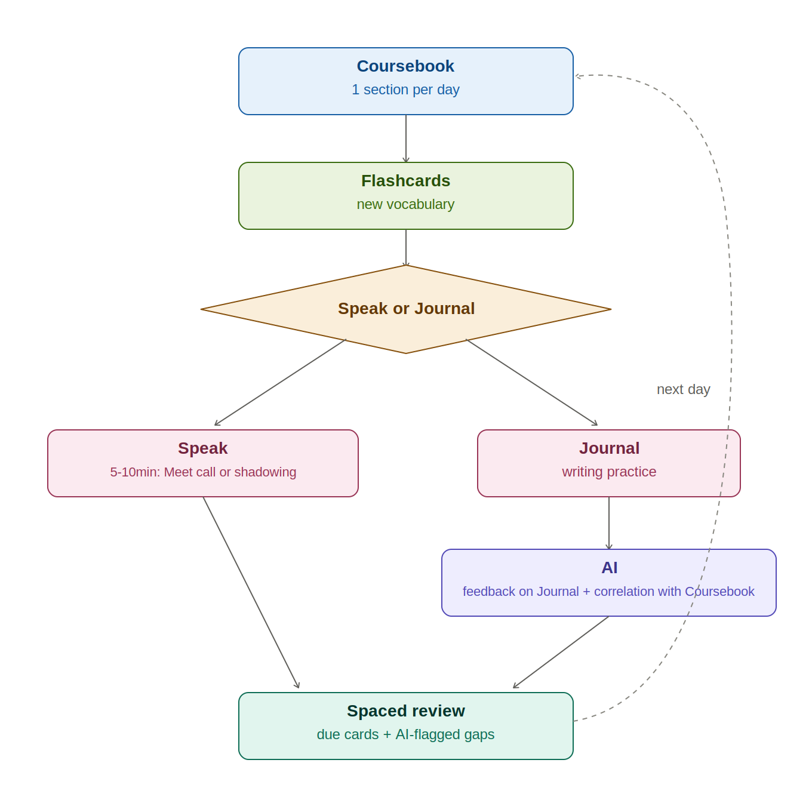

   
  <h1>📖 Output-First English Framework</h1>

 

  
  
  

 This is a practical, output-first self-study system designed to help language learners escape passive study habits and achieve functional fluency through daily active practice.

  <strong>Live demo:</strong> <a href="https://vihari2.github.io/output-first-english/">https://vihari2.github.io/autodidact-english/</a>

  

<h2>What is this Framework?</h2>

  This method was built to stop getting stuck in the endless "start-and-stop" study loop. Instead of just doing passive grammar exercises, this framework focuses heavily on <strong>active output (writing and speaking)</strong> so you actually use what you learn in real-time.

  By combining daily habit loops with free AI tools and a built-in spaced-repetition review step, you can continuously catch your own mistakes, learn natural phrasing, and build speaking confidence without needing an expensive teacher or partner.

<h2>Table of Contents</h2>

<ul>
  <li><a href="#what-is-this-framework">What is this Framework?</a></li>
  <li><a href="#table-of-contents">Table of Contents</a></li>
  <li><a href="#the-main-focus-output-first">The Main Focus: Output First</a></li>
  <li><a href="#the-tools">The Tools</a></li>
  <li><a href="#quick-routine">Quick Routine</a></li>
  <li><a href="#proof-of-concept-ef-set">Proof of Concept (EF SET)</a></li>
  <li><a href="#detailed-guides">Detailed Guides</a></li>
  <li><a href="#license">License</a></li>
</ul>

<h2 id="the-main-focus-output-first">The Main Focus: Output First</h2>

<ul>
  <li>✍️ <strong>Writing:</strong> Daily journaling + AI feedback (ChatGPT) to catch mistakes and learn natural phrasing.</li>
  <li>🎙️ <strong>Speaking:</strong> Solo Google Meet calls to practice expressing thoughts in present, past, and future tenses — or <strong>shadowing</strong> (repeating a short audio/video clip in real time, mimicking rhythm and pronunciation) on days you want to work on flow instead of free speech.</li>
  <li>🔁 <strong>Review:</strong> Spaced repetition of vocabulary — due flashcards plus any gaps flagged by AI feedback on your journal — before starting the next coursebook section.</li>
</ul>

<h2 id="the-tools">The Tools</h2>

<ul>
  <li><strong>ChatGPT:</strong> Instant corrections and natural rewrites for daily writing.</li>
  <li><strong>Google Meet:</strong> Recording solo practice sessions to build confidence.</li>
  <li><strong>Coursebooks &amp; YouTube:</strong> Basic grammar structure, listening practice, and shadowing source material.</li>
  <li><strong>Local notes &amp; flashcards:</strong> Tracking vocabulary, journal entries, and spaced-review scheduling directly in the website.</li>
</ul>

<h2 id="quick-routine">Quick Routine</h2>

<ol>
  <li>📚 <strong>Study:</strong> Complete one short section of an A1/A2/B1/B2 coursebook.</li>
  <li>🧠 <strong>Flashcards:</strong> Save new vocabulary from that section.</li>
  <li>🎙️✍️ <strong>Speak or Write:</strong> Talk out loud for 5–10 minutes in a solo Meet call (or do a shadowing session), or spend 10–15 minutes writing a daily journal entry and paste it into ChatGPT for feedback.</li>
  <li>🔁 <strong>Review:</strong> Go through due flashcards plus any gaps ChatGPT flagged in your last journal entry — this feeds into tomorrow's coursebook section.</li>
</ol>

  

<h2 id="proof-of-concept-ef-set">Proof of Concept (EF SET)</h2>

<ul>
  <li><strong>Date:</strong> 17/08/2026</li>
  <li><strong>Score / Level:</strong> <em>B2 Independent - 53/100</em></li>
</ul>

<h2 id="detailed-guides">Detailed Guides</h2>

Check the <code>please-read/</code> folder for specific steps:

<ul>
  <li>✍️ <a href="please-read/writing-guide.md">Writing &amp; AI Guide</a></li>
  <li>🎙️ <a href="please-read/speaking.md">Speaking Guide</a></li>
  <li>📚 <a href="please-read/coursebooks.md">Coursebooks List</a></li>
  <li>📖 <a href="please-read/other-resources.md">Other Learning Resources</a></li>
</ul>

<h2 id="license">License</h2>

  This project is open-source and create by <a href="https://github.com/vihari2">vihari2</a>.

 

  <a href="#table-of-contents">⬆ Back to Top</a>

